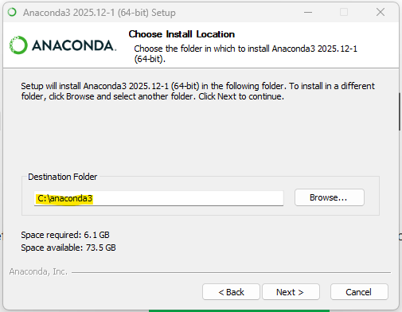

# Anaconda – Beginner Notes 🐍📦

## What is Anaconda?

**Anaconda** is an all-in-one tool that makes working with Python simple, especially for beginners. Instead of installing Python and many libraries separately, Anaconda installs everything at once. It comes with Python, commonly used libraries, and tools like **Jupyter Notebook** and **JupyterLab**, which allow you to write and run Python code in a web browser.

Anaconda also includes **Conda**, a package and environment manager that helps you install libraries and manage different projects without conflicts.

---

## Installing Anaconda on Windows

### System Requirements

* Windows 10 or Windows 11
* 64-bit system (most modern PCs)
* Internet connection

---

### Step 1: Download Anaconda

1. Open a browser and go to: [https://www.anaconda.com](https://www.anaconda.com)
2. Click **Free Download** (top-right *before* "Sign In")
 
 
  
3. Select **Get Started**
   
  

4. Select sign up with "**Google**"

 
 
5. Select appropriate gmail ID.
6. Fill-in you Name on next screen (if its shown).  
7. **Skip** other steps, until you see the following screen.

  
   
8. Select **Windows 64-Bit Graphical Installer**
9. This will download the **64-Bit Graphical Installer**, e.g. something like "Anaconda3-2025.12-1-Windows-x86_64.exe"

---

### Step 2: Run the Installer

1. Open the downloaded `.exe` file
2. Go with default options, by clicking "Next" on subsequent screen(s)
3. Click **I Agree** to accept the license
4. Select Installation Type "**Just Me (recommended)**"
5. Choose simple path for installation like "**C:\anaconda3**" (keep folder name as **anaconda3** only)

  
  
---

### Step 3: Installation Options

* Choose **Just Me (recommended)**
* Keep the **default installation location** OR simple path for installation like "**C:\anaconda3**" (keep folder name as **anaconda3** only)
* In **Advanced Options**:

  * ✅ Register Anaconda as my default Python
  * ❌ Do NOT add Anaconda to PATH

Click **Install** and wait for the setup to complete.

---

### Step 4: Verify Installation

Open **Anaconda Prompt** from the Start Menu and run:

```bash
conda --version
```

If a version number appears, Anaconda is installed correctly ✅

---

### Tools Installed with Anaconda

* Python
* Conda (package & environment manager)
* Jupyter Notebook
* JupyterLab
* Spyder (Python IDE)
* Popular libraries (NumPy, pandas, matplotlib, etc.)

